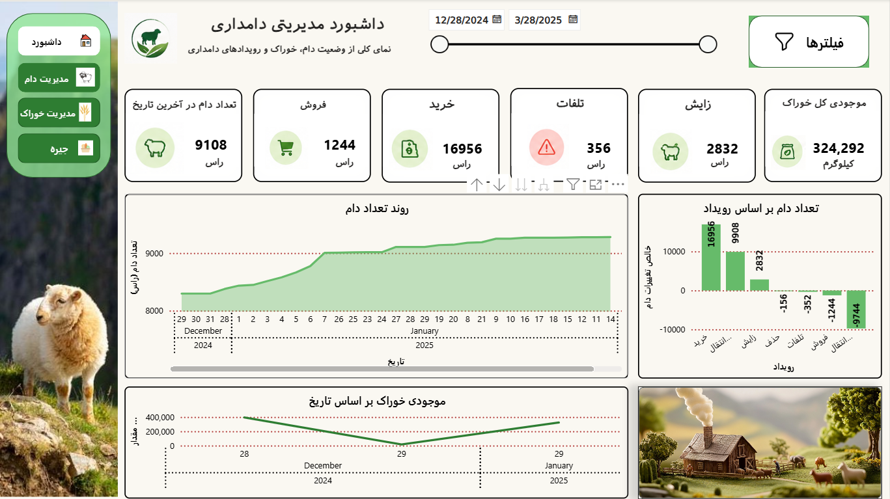
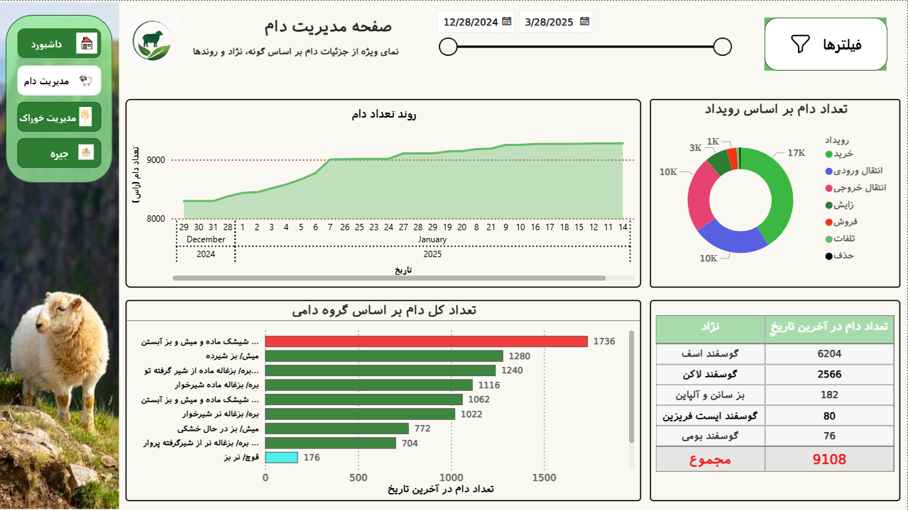
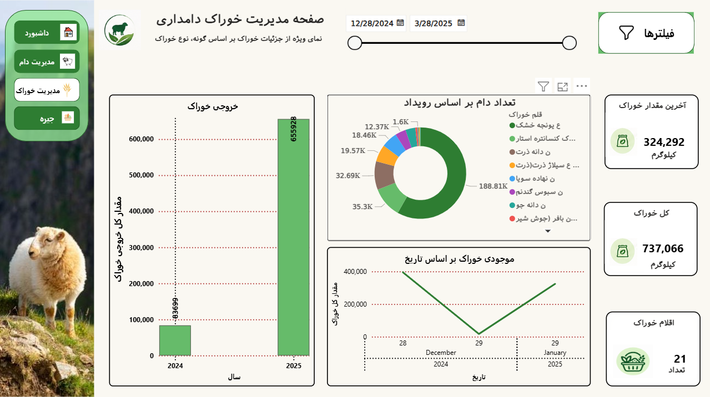
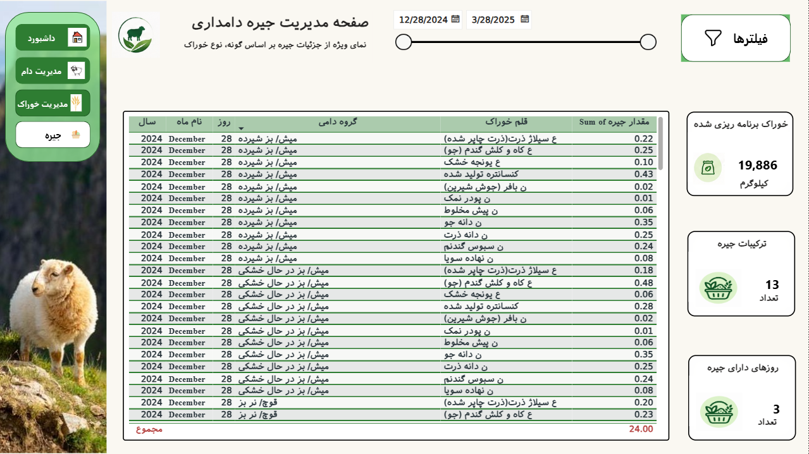
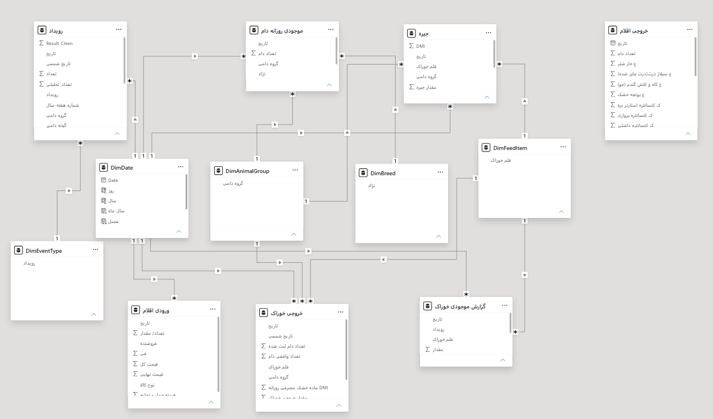

# 🐑 Livestock Business Intelligence Dashboard


 
 
**An end-to-end Business Intelligence solution for livestock farm management — covering herd inventory, livestock events (purchases, sales, births, mortality), feed inventory & consumption, and ration planning — built with Microsoft Power BI.** 
 
> 🌐 The report is fully designed in **Persian (RTL)** for farm managers and operational stakeholders. 
 
--- 
 
## 📊 Project Overview 
 
This project transforms raw livestock farm records stored in **Excel** into an interactive, multi-page BI dashboard. It enables farm managers to monitor herd population dynamics, track feed inventory and consumption, evaluate ration plans, and make data-driven operational decisions — all from a single interactive report. 
 
## ❓ Business Questions Answered 
 
### 1️⃣ Herd Inventory & Changes 
- What is the total livestock count in each time period? 
- How does herd inventory trend across different periods? 
- How many animals entered or left the farm in a specified period? 
- What is the breed composition of the herd? (Which breeds have the highest and lowest counts?) 
 
### 2️⃣ Purchases, Sales & Births 
- How many animals were sold in a specified period? 
- How many new animals were purchased during the period? 
- What is the number of births in each time period? 
- How many animals were lost (mortality) during the period? 
 
### 3️⃣ Feed Management & Ration Planning 
- How much feed was received and consumed? 
- In which periods was feed consumption at its highest and lowest? 
- What is the daily feed intake per animal (DMI)? 
- How much feed is allocated to each animal / livestock group? 
 
## 🧭 Report Pages 
 
### 1. Management Dashboard (Overview) 
Executive-level view of the entire farm: herd KPI cards, livestock event waterfall (purchase, transfer-in, birth, culling, mortality, sale, transfer-out), herd population trend over time, and feed inventory curve. 
 
 
 
### 2. Livestock Management 
Deep-dive into herd analytics: population trend, event breakdown (donut chart), total head count by livestock group (milking, drying, suckling, weaned, rams/bucks), and head count by breed as of the latest date. 
 
 
 
### 3. Feed Management 
Feed inventory & consumption monitoring: latest feed stock, total feed handled, active feed items, yearly feed output, consumption split by feed item (alfalfa, corn silage, soybean meal, barley, concentrates, …), and feed inventory over time. 
 
 
 
### 4. Ration Management 
Ration planning details: planned feed quantity, number of ration combinations, ration days, and a detailed ration matrix by livestock group × feed item showing per-head allocation (kg). 
 
 
 
## 🎯 Key KPIs & Metrics 
 
| KPI | Description | 
|---|---| 
| Livestock Count (Last Date) | Total head count as of the latest report date | 
| Purchases / Sales | Animals purchased / sold in the selected period | 
| Births / Mortality | Animals born / lost in the selected period | 
| Total Feed Inventory | Current feed stock on hand (kg) | 
| Total Feed / Feed Output | Total feed received and consumed (kg) | 
| Planned Feed | Feed quantity planned through rations (kg) | 
| Ration Combinations | Number of distinct ration formulations | 
| Ration Days | Number of days with an active ration plan | 
 
## 🛠 Tools & Technologies 
 
- **Power BI Desktop** — Visualization & report design 
- **Power Query (M)** — Data extraction, cleaning & transformation 
- **DAX** — Calculated measures & time intelligence 
- **Data Modeling** — Star schema & table relationships 
- **Microsoft Excel** — Source data 
 
## 🔄 Data Pipeline 
 
``` 
Excel Source Files 
        ↓ 
Power Query (Extract, Clean & Transform) 
        ↓ 
Data Modeling (Star Schema & Relationships) 
        ↓ 
DAX Measures (KPIs & Time Intelligence) 
        ↓ 
Interactive Power BI Report (4 Pages, Persian RTL) 
``` 
 
## 🧩 Data Model 
 
 
 
## 📁 Repository Structure 
 
``` 
📦 Livestock-BI-Dashboard 
 ┣ 📄 README.md 
 ┣ 📄 Livestock_BI_Dashboard.pbix 
 ┣ 📂 Data/ 
 ┃   ┗ 📄 Source Excel files 
 ┣ 📂 Screenshots/ 
 ┃   ┣ 🖼 01-Dashboard-Overview.png 
 ┃   ┣ 🖼 02-Livestock-Management.png 
 ┃   ┣ 🖼 03-Feed-Management.png 
 ┃   ┗ 🖼 04-Ration-Management.png 
 ┗ 📂 Data-Model/ 
     ┗ 🖼 Data-Model.png 
``` 
 
## 🚀 How to Use 
 
1. Clone or download this repository. 
2. Open `Livestock_BI_Dashboard.pbix` with **Power BI Desktop** (latest version recommended). 
3. If prompted, point the data source to the Excel files inside the `Data/` folder and refresh. 
4. Navigate between the 4 pages using the side navigation panel and explore with the interactive date-range slider. 
 
## 💡 Snapshot of Results (Dec 28, 2024 – Mar 28, 2025) 
 
- 🐑 **9,108** head on farm at the latest date 
- 🛒 **16,956** purchased | 💰 **1,244** sold 
- 🍼 **2,832** births | ⚠️ **356** mortalities 
- 🌾 **324,292 kg** feed inventory | **737,066 kg** total feed handled 
- 🧪 **21** feed items | **13** ration combinations | **19,886 kg** planned feed 
 
## 👤 Author 
 
**Mahdi Ghasemi** 
Data Analyst | Business Intelligence Developer 
• Excel • Power BI • DAX • Power Query • SQL • Data Analysis 
 
🔗 LinkedIn: https://www.linkedin.com/in/mohammadmahdi-ghasemi-704075225/
📧 Email: mahdigh1892@gmail.com